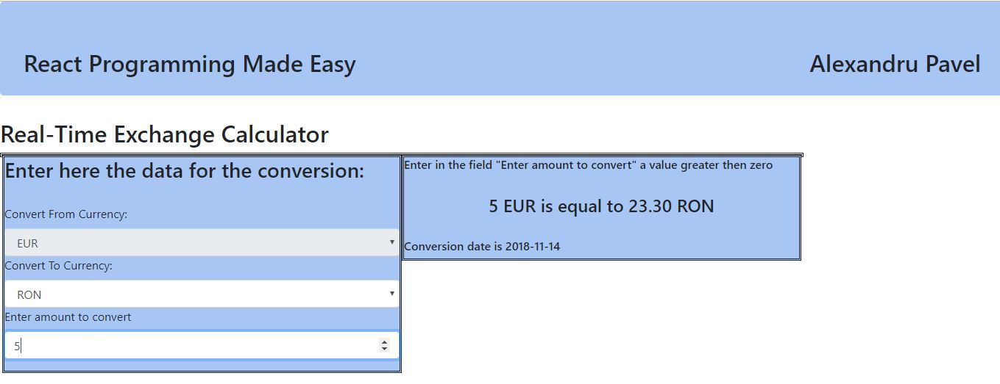

# Exchange Rate Calculator
The App represents a very simple Exchange Rate Calculator to demonstrate the basic of React Programming

## Getting Started
These instructions will get you a copy of the project up and running on your local machine for development and testing purposes. 

### Prerequisites
Node.js

### Installing
1. After download run "npm install" to download all required dependencies.
2. Run the program with "npm start"
3. The App will start in your default Browser on localhost:3000

Have Fun with it :)

